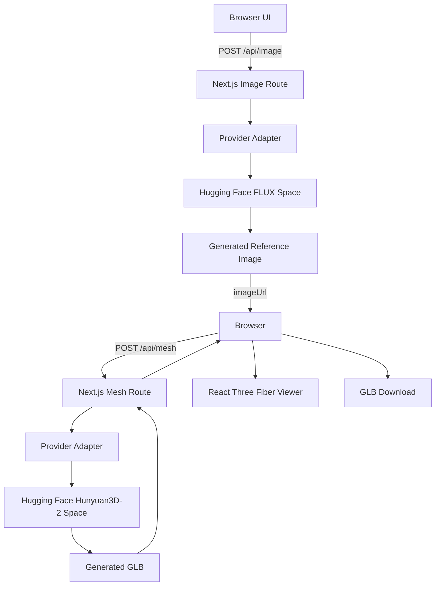

# Text-to-3D Studio

> Turn a text description into a viewable and downloadable 3D model in the browser using a two-stage AI pipeline: text → image → 3D.

**Live Demo:** Live Demo: https://text-to-3d-studio-seven.vercel.app

---

## Overview

Text-to-3D Studio is a responsive web application that converts a natural-language description of an object into a 3D model.

The application uses a stateless two-step pipeline:

```text
Text prompt
    ↓
Text-to-image generation
    ↓
Reference image
    ↓
Image-to-3D generation
    ↓
GLB model
    ↓
Interactive browser viewer
```

Generated models are returned as GLB files, displayed using React Three Fiber, and can be downloaded directly from the browser.

---

## Features

* Text prompt input with server-side validation.
* 200-character prompt limit with live character counter.
* Example prompt chips.
* Step-by-step generation status.
* Elapsed generation timer.
* Retry support for failed generation steps.
* Interactive GLB viewer.
* Orbit controls for:

  * Rotate
  * Zoom
  * Pan
* Model auto-centering and auto-scaling.
* Reset-view control.
* Auto-rotate control.
* Generated reference-image preview.
* Download generated models as `.glb`.
* Prompt-based GLB filenames.
* Pre-generated sample models when live AI generation is unavailable.
* Responsive dark UI.
* Server-side Hugging Face authentication.
* Provider adapter architecture allowing the AI provider implementation to be replaced.
* Best-effort per-IP rate limiting.
* GLB validation using the `glTF` binary magic header.

---

## Tech Stack

### Frontend

* Next.js 16.3.6
* React 19.2.8
* TypeScript
* Tailwind CSS
* React Three Fiber
* `@react-three/drei`
* Three.js

### Backend

* Next.js App Router route handlers
* Node.js runtime
* Hugging Face Spaces
* `@gradio/client`

### AI

* `black-forest-labs/FLUX.1-schnell`
* `tencent/Hunyuan3D-2`

### Testing

* Vitest
* Mock provider for local automated tests

### Deployment

* Vercel
* GitHub

---

## Architecture

The application uses a client-orchestrated, stateless two-step architecture.



### Why two API calls?

The application deliberately does not use a database, Redis, or background-job system.

The browser orchestrates two independent server requests:

1. Generate the reference image.
2. Send the resulting image URL to the image-to-3D provider.

This keeps the pipeline stateless while allowing the UI to show progress for each generation stage.

---

## AI Pipeline

### 1. Text → Image

**Space ID**

```text
black-forest-labs/FLUX.1-schnell
```

**Verified endpoint in `docs/PROVIDER_NOTES.md`**

```text
/infer
```

FLUX.1-schnell was selected because it was actually connected and successfully executed during provider discovery. It generated the reference image required by the second stage.

The verified configuration used a 1024 × 1024 image and 4 inference steps.

Observed image-generation timings:

```text
P0.3: 8.61s
P2.3: 7.78s
```

The generated image was downloaded successfully and verified as a valid image file.

### 2. Image → 3D

**Space ID**

```text
tencent/Hunyuan3D-2
```

**Verified endpoint in `docs/PROVIDER_NOTES.md`**

```text
/shape_generation
```

Hunyuan3D-2 was selected because it was successfully connected and produced a valid GLB during provider discovery.

The successful test produced a GLB with the expected:

```text
glTF
```

binary header.

Observed mesh-generation timings:

```text
P0.3: 10.80s
P2.3: 16.46s
```

The provider notes record a successful end-to-end text → image → GLB execution using these two Spaces.

### Why these providers?

The providers were not selected purely from model reputation or documentation.

They were selected because the actual Spaces were connected and the complete pipeline was executed successfully during provider discovery. Alternative providers were investigated, but their complete generation pipelines were not established.

---

## Observed Performance

These are measurements from actual successful provider runs, not performance guarantees.

### Earlier verified run

```text
Text → Image: 8.61s
Image → 3D:   10.80s
Total:        19.41s
```

### Later verified run

```text
Text → Image: 7.78s
Image → 3D:   16.46s
Total:        24.24s
```

A practical observed end-to-end figure is therefore approximately **20–25 seconds**, with the later verification completing in **24.24 seconds**. Actual latency can vary because the application depends on shared Hugging Face infrastructure.

---

## Local Setup

### Requirements

* Node.js
* npm
* Git
* A Hugging Face account/token for the real provider

### 1. Clone the repository

```bash
git clone https://github.com/signioratul/text-to-3d-studio.git
cd text-to-3d-studio
```

### 2. Install dependencies

```bash
npm i
```

### 3. Configure environment variables

Create:

```text
.env.local
```

Do not commit this file.

For real provider usage:

```env
PROVIDER=hf
HF_TOKEN=your_hugging_face_token
IMAGE_TIMEOUT_MS=120000
MESH_TIMEOUT_MS=240000
RATE_LIMIT_MAX=3
RATE_LIMIT_WINDOW_MIN=1
```

For local UI development without calling the real AI provider:

```env
PROVIDER=mock
```

The mock provider uses the local sample image and GLB.

### 4. Start the development server

```bash
npm run dev
```

Open:

```text
http://localhost:3000
```

---

## Environment Variables

| Variable                | Required          | Description                                           | Example  |
| ----------------------- | ----------------- | ----------------------------------------------------- | -------- |
| `PROVIDER`              | Yes               | Selects the provider implementation                   | `hf`     |
| `HF_TOKEN`              | Required for `hf` | Server-only Hugging Face authentication token         | `hf_...` |
| `IMAGE_TIMEOUT_MS`      | Yes               | Image-generation request timeout in milliseconds      | `120000` |
| `MESH_TIMEOUT_MS`       | Yes               | Image-to-3D request timeout in milliseconds           | `240000` |
| `RATE_LIMIT_MAX`        | Yes               | Maximum requests allowed within the configured window | `3`      |
| `RATE_LIMIT_WINDOW_MIN` | Yes               | Rate-limit window in minutes                          | `1`      |

`HF_TOKEN` must remain server-side. It must never be exposed through a `NEXT_PUBLIC_*` variable.

The repository's `.env.example` contains placeholders only and is safe to commit.

---

## Testing

Run the automated test suite:

```bash
npm test
```

The tests use the mock provider and do not call the real AI services.

Run the production build:

```bash
npm run build
```

Run linting:

```bash
npm run lint
```

The project was verified locally with:

```text
Tests: 6 passed
Production build: passed
TypeScript: passed
```

---

## Deployment

The application is designed for Vercel deployment.

### 1. Push the repository to GitHub

The repository is available at:

```text
https://github.com/signioratul/text-to-3d-studio
```

### 2. Import the repository into Vercel

Create a new Vercel project and import the GitHub repository.

### 3. Configure production environment variables

Add the required variables under the **Production** environment:

```text
PROVIDER
HF_TOKEN
IMAGE_TIMEOUT_MS
MESH_TIMEOUT_MS
RATE_LIMIT_MAX
RATE_LIMIT_WINDOW_MIN
```

Use `PROVIDER=hf` for real AI generation.

### 4. Deploy

Deploy the project from Vercel.

The application uses Next.js route handlers for:

```text
/api/image
/api/mesh
```

The mesh route is configured for a long-running serverless invocation because 3D generation is substantially slower than normal web requests.

### 5. Verify

After deployment, verify:

* The homepage loads.
* The prompt form works.
* `/api/image` reaches the Hugging Face provider.
* `/api/mesh` returns GLB data when the provider is available.
* The GLB loads in the viewer.
* The GLB can be downloaded.

---

## Known Limitations

### Hugging Face ZeroGPU availability

The real provider depends on shared Hugging Face ZeroGPU infrastructure.

ZeroGPU has daily per-account quotas and shared queueing. Hugging Face currently documents 5 minutes of included daily GPU usage for Free accounts and higher quotas for paid tiers.

When the provider quota is exhausted, generation cannot proceed until the quota becomes available again or additional eligible usage is obtained.

The deployed application has been verified to reach the Hugging Face provider, but the current production test encountered:

```text
429
The AI service has reached its available quota. Please try again later.
```

Therefore, continuous live generation availability is not guaranteed.

### Best-effort rate limiting

The application uses an in-memory per-IP rate limiter.

It is intentionally documented as **best effort** because serverless instances do not share memory. It should not be treated as a globally enforced distributed rate limiter.

### Generation quality varies

The final 3D result depends on both stages of the pipeline:

```text
Prompt → generated reference image → 3D reconstruction
```

Different prompts and generated reference images can produce different geometry and visual quality.

The application does not claim production-grade consistency across arbitrary prompts.

### Latency varies

Observed successful end-to-end generation took:

```text
19.41s
24.24s
```

These measurements were obtained during provider testing. They are not guaranteed response times.

Queueing, provider availability, model execution time, network conditions, and quota status can change the actual latency.

### Textures and visual fidelity

The quality of the generated model depends on the provider output. The application validates the GLB format but does not guarantee a particular polygon count, topology, texture quality, or visual fidelity.

### Remote cancellation

The provider investigation established local request cancellation behavior, but remote cancellation of an already-submitted Hugging Face generation job was not verified.

---

## Fallback Behavior

When live generation is unavailable because of provider failures or quota-related errors, the application can show pre-generated sample models.

These samples are explicitly presented as samples and are not represented as newly generated output.

This allows the 3D viewer and download experience to remain demonstrable even when the external AI provider is unavailable.

---

## Security

* Hugging Face credentials are stored server-side.
* `.env*` files are excluded from Git except `.env.example`.
* No client-side `NEXT_PUBLIC_*` token is used.
* Prompt validation occurs server-side.
* `/api/mesh` validates the allowed image URL hosts.
* Generation responses use `Cache-Control: no-store`.
* Provider errors are mapped to application-level error codes.
* Tokens are not returned in API responses or intentionally logged.

---

## Future Improvements

### Paid or dedicated inference

Move from shared/free-tier inference to a paid or dedicated inference service to reduce queueing and quota-related failures.

### Persistent generation gallery

Add persistent storage for generated models and metadata so users can revisit previous generations across sessions and devices.

### Texture and quality controls

Expose generation controls such as:

* Texture generation
* Mesh quality
* Polygon/detail level
* Generation steps
* Seed control

### Better provider resilience

Add additional verified provider implementations behind the existing provider adapter so the application can switch providers when one is unavailable.

### Generation history

Persist recent prompts and preview images in a user-accessible gallery while keeping large GLB binaries out of browser local storage.

### Improved observability

Add structured production metrics for:

* Image-generation latency
* Mesh-generation latency
* Provider failures
* Quota failures
* Successful GLB generation
* Download completion

---

## Project Structure

```text
text-to-3d/
├── app/
│   ├── api/
│   │   ├── image/
│   │   │   └── route.ts
│   │   └── mesh/
│   │       └── route.ts
│   ├── layout.tsx
│   └── page.tsx
│
├── components/
│   ├── DownloadButton.tsx
│   ├── ModelViewer.tsx
│   ├── PromptForm.tsx
│   ├── SampleGallery.tsx
│   └── StatusPanel.tsx
│
├── hooks/
│   └── useGeneration.ts
│
├── lib/
│   ├── errors.ts
│   ├── prompt.ts
│   ├── rateLimit.ts
│   └── providers/
│       ├── hf.ts
│       ├── index.ts
│       ├── mock.ts
│       └── types.ts
│
├── public/
│   └── samples/
│
├── scripts/
│   └── probe-provider.mjs
│
├── tests/
│   └── providers.test.ts
│
├── docs/
│   ├── DECISIONS.md
│   ├── PROVIDER_NOTES.md
│   └── PROGRESS.md
│
├── .env.example
├── AGENT.md
├── package.json
└── README.md
```

---

## Provider Investigation

Several alternative Spaces were investigated during development.

`microsoft/TRELLIS.2` was successfully connected and its endpoints were probed, but a complete generation pipeline was not established.

`stabilityai/TripoSR` and `microsoft/TRELLIS` encountered Space/configuration failures during investigation and were not selected.

They are therefore not presented as working providers in this project.

---

## License

This project's application code is provided for demonstration and portfolio purposes.

The underlying AI models and services retain their respective licenses and usage conditions. Refer to the provider and model documentation before using generated outputs commercially.

---

## Status

The application has:

* A completed Next.js frontend.
* An interactive GLB viewer.
* A two-stage AI provider architecture.
* Verified Hugging Face provider integration.
* Automated tests using the mock provider.
* A successful production build.
* A deployed Vercel application.
* Server-side provider credentials.
* GLB download support.
* Sample-model fallback.

Live AI generation availability currently depends on Hugging Face provider quota and shared ZeroGPU availability.
